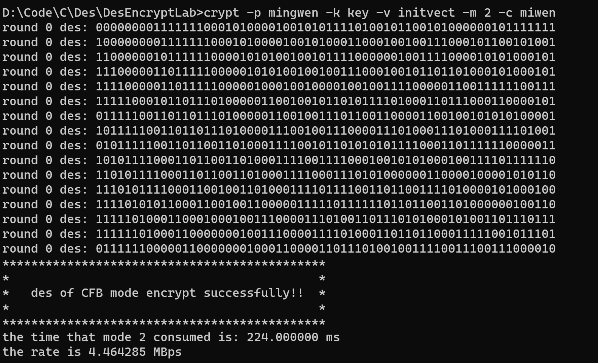
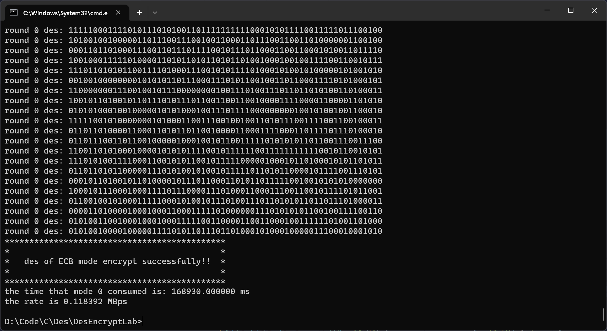

[toc]

> 大二的时候写的程序了，代码写的很烂只关注效果的实现了。这么烂的代码估计只有自己能看懂了。

使用示例——加密

```sh
DesEncrypt -p a_plain_text -k a_key -v a_initvec -m 1 -c a_cipher_text
```

使用示例——解密

```sh
DesEncrypt -p a_decrypt_text -k a_key -v a_initvec -m 5 -c a_cipher_text
```

# 一、实践内容

## DES 算法的原理

### 子密钥生成过程

子密钥计算接受初始密钥或者上一轮的密钥作为输入，如果是初始密钥则进行 PC1 置换，然后将密钥分为左右两部分，对这两部分进行 LS 置换，置换后将结果合并并经过 PC2 置换得到此轮的子密钥。子密钥计算过程如下：


### DES 加密步骤

是一种明文分组为 64 比特，有效密钥 56 比特， 输出密文 64 比特的，具有 16 轮迭代的 Feistel 密码算法。

总体实现过程如图所示：


DES 的 f 函数为 f(R, K)=P(S(K XOR E(R)))，首先将 32 位的 R 经过 E 扩展运算变为 48 位，然后将结果与 48 位的密钥 K 进行异或运算，得到的结果经过 S 盒变换，最后经过 P 置换得到最终的结果。

如下图所示：


## 分组密码的操作模式

### ECB

电子密码本模式，将每块明文加密成相应的密码块，若最后一块不足 64bit，则用一些任意二进制序列填充。这样相同的明文块总被加密成相同的密文块。这是最简单的分组密码操作模式，每个明文分组的处理是相互独立的，每个 b 位的明文都有一个对应的唯一密文，因此可以将其想象成一个巨大的密码本。这种方式的缺点是没有任何形式的反馈，容易暴露明文数据的固有格式。

### CBC

密码分组链接模式，引入了反馈机制，当前明文块在加密之前要与前一分组的密文块进行异或操作。

加密流程如下所示


解密流程如下所示


### CFB

密码反馈模式，数据是按比分组小得多的单位进行加密的，密文依赖于前面所有的明文。在这种模式下，加密函数的输入是一个 b 位的移位寄存器，这个寄存器被初始化为向量 IV，加密的结果最左边 s 位与明文分组异或产生密文分组，同时移位寄存器左移 s 位，且用密文分组替换寄存器最右边的 s 位。

在这种情况下，一个密文分组出错会影响后面最多[b/s]个分组的解密。

### OFB

输出反馈模式，与 CFB 模式相似，但它是在块内部进行反馈，其反馈机制既不依赖明文也不依赖密文流，所以又称为内部反馈模式。

加密过程如下


这种模式解密不存在无码扩散。

# 二、实践环境

## 软件环境

操作系统：Windows 11

IDE：visual studio code

编译器：gcc 11.2.0

## 硬件环境

CPU： AMD Ryzen 5

# 三、实践过程与步骤

## 置换表

在 SwitchTable.h 当中定义了许多 DES 算法需要用到的置换表

初始 IP 置换表和 IP 逆置换表

```c
// 初始置换表
static const int ip_table[64] = {
    58, 50, 42, 34, 26, 18, 10, 2,
    60, 52, 44, 36, 28, 20, 12, 4,
    62, 54, 46, 38, 30, 22, 14, 6,
    64, 56, 48, 40, 32, 24, 16, 8,
    57, 49, 41, 33, 25, 17, 9, 1,
    59, 51, 43, 35, 27, 19, 11, 3,
    61, 53, 45, 37, 29, 21, 13, 5,
    63, 55, 47, 39, 31, 23, 15, 7};

// ip逆置换表
static const int ipre_table[64] = {
    40, 8, 48, 16, 56, 24, 64, 32,
    39, 7, 47, 15, 55, 23, 63, 31,
    38, 6, 46, 14, 54, 22, 62, 30,
    37, 5, 45, 13, 53, 21, 61, 29,
    36, 4, 44, 12, 52, 20, 60, 28,
    35, 3, 43, 11, 51, 19, 59, 27,
    34, 2, 42, 10, 50, 18, 58, 26,
    33, 1, 41, 9, 49, 17, 57, 25};
```

E 扩展运算表

```c
// E扩展运算表
static const int e_table[48] = {
    32, 1, 2, 3, 4, 5,
    4, 5, 6, 7, 8, 9,
    8, 9, 10, 11, 12, 13,
    12, 13, 14, 15, 16, 17,
    16, 17, 18, 19, 20, 21,
    20, 21, 22, 23, 24, 25,
    24, 25, 26, 27, 28, 29,
    28, 29, 30, 31, 32, 1};
```

P 置换表

```c
// p置换表
static const int p_table[32] = {
    16, 7, 20, 21, 29, 12, 28, 17,
    1, 15, 23, 26, 5, 18, 31, 10,
    2, 8, 24, 14, 32, 27, 3, 9,
    19, 13, 30, 6, 22, 11, 4, 25};
```

S 盒

```c
// s盒
static const int s_table[8][4][16] = {
    14, 4, 13, 1, 2, 15, 11, 8, 3, 10, 6, 12, 5, 9, 0, 7,
    0, 15, 7, 4, 14, 2, 13, 1, 10, 6, 12, 11, 9, 5, 3, 8,
    4, 1, 14, 8, 13, 6, 2, 11, 15, 12, 9, 7, 3, 10, 5, 0,
    15, 12, 8, 2, 4, 9, 1, 7, 5, 11, 3, 14, 10, 0, 6, 13,

    15, 1, 8, 14, 6, 11, 3, 4, 9, 7, 2, 13, 12, 0, 5, 10,
    3, 13, 4, 7, 15, 2, 8, 14, 12, 0, 1, 10, 6, 9, 11, 5,
    0, 14, 7, 11, 10, 4, 13, 1, 5, 8, 12, 6, 9, 3, 2, 15,
    13, 8, 10, 1, 3, 15, 4, 2, 11, 6, 7, 12, 0, 5, 14, 9,

    10, 0, 9, 14, 6, 3, 15, 5, 1, 13, 12, 7, 11, 4, 2, 8,
    13, 7, 0, 9, 3, 4, 6, 10, 2, 8, 5, 14, 12, 11, 15, 1,
    13, 6, 4, 9, 8, 15, 3, 0, 11, 1, 2, 12, 5, 10, 14, 7,
    1, 10, 13, 0, 6, 9, 8, 7, 4, 15, 14, 3, 11, 5, 2, 12,

    7, 13, 14, 3, 0, 6, 9, 10, 1, 2, 8, 5, 11, 12, 4, 15,
    13, 8, 11, 5, 6, 15, 0, 3, 4, 7, 2, 12, 1, 10, 14, 9,
    10, 6, 9, 0, 12, 11, 7, 13, 15, 1, 3, 14, 5, 2, 8, 4,
    3, 15, 0, 6, 10, 1, 13, 8, 9, 4, 5, 11, 12, 7, 2, 14,

    2, 12, 4, 1, 7, 10, 11, 6, 8, 5, 3, 15, 13, 0, 14, 9,
    14, 11, 2, 12, 4, 7, 13, 1, 5, 0, 15, 10, 3, 9, 8, 6,
    4, 2, 1, 11, 10, 13, 7, 8, 15, 9, 12, 5, 6, 3, 0, 14,
    11, 8, 12, 7, 1, 14, 2, 13, 6, 15, 0, 9, 10, 4, 5, 3,

    12, 1, 10, 15, 9, 2, 6, 8, 0, 13, 3, 4, 14, 7, 5, 11,
    10, 15, 4, 2, 7, 12, 9, 5, 6, 1, 13, 14, 0, 11, 3, 8,
    9, 14, 15, 5, 2, 8, 12, 3, 7, 0, 4, 10, 1, 13, 11, 6,
    4, 3, 2, 12, 9, 5, 15, 10, 11, 14, 1, 7, 6, 0, 8, 13,

    4, 11, 2, 14, 15, 0, 8, 13, 3, 12, 9, 7, 5, 10, 6, 1,
    13, 0, 11, 7, 4, 9, 1, 10, 14, 3, 5, 12, 2, 15, 8, 6,
    1, 4, 11, 13, 12, 3, 7, 14, 10, 15, 6, 8, 0, 5, 9, 2,
    6, 11, 13, 8, 1, 4, 10, 7, 9, 5, 0, 15, 14, 2, 3, 12,

    13, 2, 8, 4, 6, 15, 11, 1, 10, 9, 3, 14, 5, 0, 12, 7,
    1, 15, 13, 8, 10, 3, 7, 4, 12, 5, 6, 11, 0, 14, 9, 2,
    7, 11, 4, 1, 9, 12, 14, 2, 0, 6, 10, 13, 15, 3, 5, 8,
    2, 1, 14, 7, 4, 10, 8, 13, 15, 12, 9, 0, 3, 5, 6, 11};
```

PC1 和 PC2 置换表

```c
// pc1置换
static const int pc1_table[56] = {
    57, 49, 41, 33, 25, 17, 9,
    1, 58, 50, 42, 34, 26, 18,
    10, 2, 59, 51, 43, 35, 27,
    19, 11, 3, 60, 52, 44, 36,
    63, 55, 47, 39, 31, 23, 15,
    7, 62, 54, 46, 38, 30, 22,
    14, 6, 61, 53, 45, 37, 29,
    21, 13, 5, 28, 20, 12, 4};

// pc2置换
static const int pc2_table[48] = {
    14, 17, 11, 24, 1, 5,
    3, 28, 15, 6, 21, 10,
    23, 19, 12, 4, 26, 8,
    16, 7, 27, 20, 13, 2,
    41, 52, 31, 37, 47, 55,
    30, 40, 51, 45, 33, 48,
    44, 49, 39, 56, 34, 53,
    46, 42, 50, 36, 29, 32};
```

ls 行移位表

```c
// ls行移位表
static const int ls_table[16] = {
    1, 1, 2, 2, 2, 2, 2, 2, 1, 2, 2, 2, 2, 2, 2, 1};
```

## 字符操作

在 TextSwitch.h 当中定义了十六进制、十进制、二进制字符串格式的转化以及明密文文件的读写操作

二进制转十进制

```c
// 2进制转10进制
int bin2dec(char *bin)
{
    int res = 0;
    int len = strlen(bin);
    char temp[2];
    temp[0] = '0';
    temp[1] = '1';
    for (size_t i = 0; i < len; i++)
    {
        if (bin[len - i - 1] == temp[1])
        {
            res += pow(2, i);
        }
        else
        {
            continue;
        }
    }
    return res;
}
```

十进制转二进制

```c
// 十进制转二进制
int dec2bin(int n)
{
    int sum = 0;
    int y, x = 1; // y表示余数，x为叠加的系数
    while (n != 0)
    {
        y = n % 2;
        sum += x * y;
        x *= 10;
        n /= 2;
    }
    return sum;
}
```

十六进制转二进制

```c
// 十六进制转二进制
void hex2bin(char *hex, char *bin)
{
    int len = strlen(hex);
    char buff[65];
    char binbuff[65] = {0};
    for (int i = 0; i < len; i++)
    {
        switch (hex[i])
        {
        case '0':
            strcpy(buff, "0000");
            strncat(binbuff, buff, 4);
            break;
        case '1':
            strcpy(buff, "0001");
            strncat(binbuff, buff, 4);
            break;
        case '2':
            strcpy(buff, "0010");
            strncat(binbuff, buff, 4);
            break;
        case '3':
            strcpy(buff, "0011");
            strncat(binbuff, buff, 4);
            break;
        case '4':
            strcpy(buff, "0100");
            strncat(binbuff, buff, 4);
            break;
        case '5':
            strcpy(buff, "0101");
            strncat(binbuff, buff, 4);
            break;
        case '6':
            strcpy(buff, "0110");
            strncat(binbuff, buff, 4);
            break;
        case '7':
            strcpy(buff, "0111");
            strncat(binbuff, buff, 4);
            break;
        case '8':
            strcpy(buff, "1000");
            strncat(binbuff, buff, 4);
            break;
        case '9':
            strcpy(buff, "1001");
            strncat(binbuff, buff, 4);
            break;
        case 'a':
        case 'A':
            strcpy(buff, "1010");
            strncat(binbuff, buff, 4);
            break;
        case 'b':
        case 'B':
            strcpy(buff, "1011");
            strncat(binbuff, buff, 4);
            break;
        case 'c':
        case 'C':
            strcpy(buff, "1100");
            strncat(binbuff, buff, 4);
            break;
        case 'd':
        case 'D':
            strcpy(buff, "1101");
            strncat(binbuff, buff, 4);
            break;
        case 'e':
        case 'E':
            strcpy(buff, "1110");
            strncat(binbuff, buff, 4);
            break;
        case 'f':
        case 'F':
            strcpy(buff, "1111");
            strncat(binbuff, buff, 4);
            break;
        default:
            printf("err hex\n");
            break;
        }
    }
    binbuff[65] = '\0';
    strcpy(bin, binbuff);
}
```

二进制转十六进制

```c
// 二进制转十六进制
void bin2hex(char *bin, char *hex)
{
    int len = strlen(bin) / 4;
    char buf[5];
    buf[4] = '\0';
    for (size_t i = 0; i < len; i++)
    {
        for (size_t j = 0; j < 4; j++)
        {
            buf[j] = bin[i * 4 + j];
        }
        int dec = bin2dec(buf);
        switch (dec)
        {
        case 0:
            hex[i] = '0';
            break;
        case 1:
            hex[i] = '1';
            break;
        case 2:
            hex[i] = '2';
            break;
        case 3:
            hex[i] = '3';
            break;
        case 4:
            hex[i] = '4';
            break;
        case 5:
            hex[i] = '5';
            break;
        case 6:
            hex[i] = '6';
            break;
        case 7:
            hex[i] = '7';
            break;
        case 8:
            hex[i] = '8';
            break;
        case 9:
            hex[i] = '9';
            break;
        case 10:
            hex[i] = 'A';
            break;
        case 11:
            hex[i] = 'B';
            break;
        case 12:
            hex[i] = 'C';
            break;
        case 13:
            hex[i] = 'D';
            break;
        case 14:
            hex[i] = 'E';
            break;
        case 15:
            hex[i] = 'F';
            break;
        default:
            break;
        }
    }
}
```

以追加的方式写入文件

```c
// 写入文件
void writeFile(char *filename, char *txt)
{
    FILE *fp = NULL;
    fp = fopen(filename, "a+");
    fputs(txt, fp);
    fclose(fp);
}
```

## DES 实现

Des.h 实现 des 加密的完整操作，总共十六轮。

> 关于代码中的一些关键变量：keyfile 为密钥文件名，cipherfile 为密文文件名，plaintextfile 为明文文件名，initvecfile 为初始向量，keyhex 为十六进制的密钥，keybin 为二进制的密钥，vechex 为十六进制的初始化向量，vecbin 为二进制的初始化向量。

### 加解密相关函数

首先是初始 IP 置换，如下所示

```c
// 初始ip置换
void initSwitch(char *m)
{
    char temp[64];
    strcpy(temp, m);
    for (int i = 0; i < 64; i++)
    {
        m[i] = temp[ip_table[i] - 1];
    }
}
```

初始 IP 逆置换如下

```c
void reIPSwitch(char *m)
{
    char temp[65];
    strcpy(temp, m);
    for (int i = 0; i < 64; i++)
    {
        m[i] = temp[ipre_table[i] - 1];
    }
}
```

E 扩展运算如下

```c
// E扩展运算
void extend(char *r, char *e)
{
    for (int i = 0; i < 48; i++)
    {
        e[i] = r[e_table[i] - 1];
    }
}
```

S 盒运算如下

```c
// s盒置换
void sSwitch(char *str, char *end)
{
    char s[7];
    s[6] = '\0';
    char hang[3];
    hang[2] = '\0';
    int h;
    char lie[5];
    lie[4] = '\0';
    int l;
    int afters[8];
    for (size_t i = 0; i < 8; i++)
    {
        for (size_t j = 0; j < 6; j++)
        {
            s[j] = str[6 * i + j];
        }
        hang[0] = s[0];
        hang[1] = s[5];
        for (size_t k = 0; k < 4; k++)
        {
            lie[k] = s[1 + k];
        }

        // 二进制转十进制
        h = bin2dec(hang);
        l = bin2dec(lie);

        // 完成s盒转换
        afters[i] = s_table[i][h][l];
    }
    char buf[5];
    buf[4] = '\0';
    for (size_t i = 0; i < 8; i++)
    {
        // 将s盒变换后的数字转成二进制，并补位成四位
        itoa(dec2bin(afters[i]), buf, 10);
        int lenofbuf = strlen(buf);
        switch (lenofbuf)
        {
        case 4:
            break;
            // 进行补位
        case 3:
            buf[3] = buf[2];
            buf[2] = buf[1];
            buf[1] = buf[0];
            buf[0] = '0';
            break;
        case 2:
            buf[2] = buf[0];
            buf[3] = buf[1];
            buf[0] = '0';
            buf[1] = '0';
            break;
        case 1:
            buf[3] = buf[0];
            buf[0] = '0';
            buf[1] = '0';
            buf[2] = '0';
            break;
        default:
            break;
        }
        for (size_t j = 0; j < 4; j++)
        {
            end[4 * i + j] = buf[j];
        }
    }
}
```

P 置换算法如下

```c
// p置换
void pSwitch(char *start, char *end)
{
    for (size_t i = 0; i < 32; i++)
    {
        end[i] = start[p_table[i] - 1];
    }
}
```

按位异或运算函数如下

```c
// 异或运算
// 参数分别为异或的两个数，返回的结果和异或的位数
void Xor(char *a, char *b, char *res, int len)
{
    char ret[len + 1];
    ret[len] = '\0';
    for (size_t i = 0; i < len; i++)
    {
        if (a[i] == b[i])
        {
            ret[i] = '0';
        }
        else
        {
            ret[i] = '1';
        }
    }
    strcpy(res, ret);
}
```

### 密钥生成过程

#### 相关函数

ls 移位运算

```c
// ls移位
void lsSwitch(char *str, int round)
{
    int times = ls_table[round - 1];
    char temp[28];
    strcpy(temp, str);
    for (size_t i = 0; i < 28; i++)
    {
        str[i] = temp[(i + times) % 28];
    }
}
```

#### 密钥生成

子密钥生成函数如下，为每一轮 des 加密生成密钥，key 为前一轮密钥，round 为加密的轮数、afterkey 为生成的子密钥。

首先判断是否为第一轮加密，如果是则先进行 PC1 置换，然后将密钥分解成两部分，分别进行 LS 移位之后合并，最后经过 PC2 置换生成下一轮的密钥。

```c
// 子密钥生成函数
void keyGen(char *key, int round, char *afterkey)
{
    // 如果是第一轮加密，进行pc1置换
    if (round == 1)
    {
        char temp[65];
        strcpy(temp, key);
        // pc1置换
        for (size_t i = 0; i < 56; i++)
        {
            cd[i] = temp[pc1_table[i] - 1];
        }
        cd[56] = '\0';
        c[28] = '\0';
        d[28] = '\0';
    }

    // 将cd分解为c和d
    for (size_t i = 0; i < 28; i++)
    {
        c[i] = cd[i];
        d[i] = cd[28 + i];
    }

    // 进行ls移位
    lsSwitch(c, round);
    lsSwitch(d, round);
    c[28] = '\0';
    d[28] = '\0';
    // 将移位后的c、d合并到cd
    strMerge(c, d, cd);
    cd[56] = '\0';
    // pc2置换
    for (size_t i = 0; i < 48; i++)
    {
        afterkey[i] = cd[pc2_table[i] - 1];
    }
}
```

### 加解密具体实现过程

十六轮 DES 加密的整体过程如下所示，n 为学号模 10，在第 n 轮输出加密的结果。

首先读取密钥，然后将十六进制的密钥字符串转化为二进制字符串。然后将输入 in（64 位二进制）复制到 temp，并进行 IP 置换，然后将置换后的字符串分为左右两部分，将右边的字符串进行 E 扩展运算从 32 位扩展到 48 位，并与生成的轮密钥进行异或操作得到 res。再将 res 进行 S 盒置换得到 afters 字符串，将此结果作为加密结果的左半部分，然后再将 afters 与原左半部分进行异或操作作为加密结果的右半部分并合并作为新的 temp，这样第一轮加密就结束了，按照此步骤完成 16 轮加密后，执行最后一步换位并进行 IP 逆置换，即得到最后的加密结果 out。

```c
// des加密
void des(char *in, char *out)
{
    int n = 2021141530140 % 10;
    // 读取密钥
    readKey(keyfile);
    // 密钥转换成二进制
    hex2bin(keyhex, keybin);
    keybin[64] = '\0';
    char temp[65];
    strcpy(temp, in);
    temp[64] = '\0';
    // 进行ip置换
    initSwitch(temp);
    char l[33];
    char r[33];
    // 将输入分为左右两部分
    for (size_t i = 0; i < 32; i++)
    {
        l[i] = temp[i];
        r[i] = temp[32 + i];
    }
    l[32] = '\0';
    r[32] = '\0';
    // 进行十六轮加密
    for (size_t round = 1; round < 17; round++)
    {
        // e扩展运算
        char er[49];
        er[48] = '\0';
        extend(r, er);
        // printf("exr:\t%s\n", er);

        // 生成轮密钥
        char key1[49];
        key1[48] = '\0';
        keyGen(keybin, round, key1);
        strcpy(keybin, key1);

        // 密钥与E（R）异或得到结果res
        char res[49];
        res[48] = '\0';
        Xor(keybin, er, res, 48);

        // 进行s盒置换
        char afters[64];
        sSwitch(res, afters);

        // 再进行p置换
        char afterp[33];
        afterp[32] = '\0';
        pSwitch(afters, afterp);

        // 两边再异或
        char r0[33];
        r0[32] = '\0';
        Xor(l, afterp, r0, 32);
        strMerge(r, r0, temp);
        if (round - 1 == n)
        {
            printf("round %d des: %s\n", round - 1, temp);
        }
        strcpy(l, r);
        strcpy(r, r0);
    }
    // 执行最后一步换位
    strMerge(r, l, temp);
    // 进行逆ip置换
    reIPSwitch(temp);
    strcpy(out, temp);
}
```

des 的解密过程如下，解密算法与加密算法一样，只是轮密钥反过来使用。

```c
void dedes(char *in, char *out)
{
    int n = 2021141530140 % 10;
    char temp[65];
    strcpy(temp, in);
    temp[64] = '\0';

    char keys[16][68];
    // 读取密钥
    readKey(keyfile);
    // 密钥转换成二进制
    hex2bin(keyhex, keybin);
    // 进行ip置换
    initSwitch(temp);
    char l[33];
    char r[33];
    // 将输入分为左右两部分
    for (size_t i = 0; i < 32; i++)
    {
        l[i] = temp[i];
        r[i] = temp[32 + i];
    }

    l[32] = '\0';
    r[32] = '\0';
    // 生成十六轮密钥
    for (size_t i = 0; i < 16; i++)
    {
        keyGen(keybin, i + 1, keys[i]);
        keys[i][48] = '\0';
    }
    // 解密
    for (size_t round = 1; round < 17; round++)
    {

        // e扩展运算
        char er[49];
        er[48] = '\0';
        extend(r, er);
        // printf("exr:\t%s\n", er);

        // 密钥与E（R）异或得到结果res
        char res[49];
        res[48] = '\0';
        Xor(keys[16 - round], er, res, 48);
        // printf("kxer:\t%s\n", res);

        // 进行s盒置换
        char afters[64];
        sSwitch(res, afters);
        // printf("sw:\t%s\n", afters);

        // 再进行p置换
        char afterp[33];
        afterp[32] = '\0';
        pSwitch(afters, afterp);
        // printf("ps:\t%s\n", afterp);

        // 两边再异或
        char r0[33];
        r0[32] = '\0';
        Xor(l, afterp, r0, 32);
        // printf("l%d:\t%s\n", round, r);
        // printf("r%d:\t%s\n", round, r0);
        strMerge(r, r0, temp);
        // printf("out:\t%s\n", in);
        if (round - 1 == n)
        {
            printf("round %d des: %s\n", round - 1, temp);
        }
        strcpy(l, r);
        strcpy(r, r0);
    }
    // 执行最后一步换位
    strMerge(r, l, temp);
    // 进行逆ip置换
    reIPSwitch(temp);
    strcpy(out, temp);
}
```

## 分组密码的操作模式

> 关键变量：DATA_SIZE 生成的测试数据大小（10KB），pkthex 十六进制密文分组，pktbin 二进制密文分组，cipherbin 二进制的密文，cipherhex 十六进制的密文。

生成测试数据的函数如下，生成 10KB 的测试数据并写入明文文件。

```c
// 随机生成测试数据
void initTxtData()
{
    FILE *fp;
    char *data;
    int i;

    srand(time(NULL)); // 初始化随机数种子

    // 分配内存，用于存储随机生成的测试数据
    data = (char *)malloc(DATA_SIZE);
    if (data == NULL)
    {
        printf("memory allocate fail！\n");
        return;
    }

    // 生成随机测试数据
    for (i = 0; i < DATA_SIZE; i++)
    {
        data[i] = rand() % 256; // 生成0到255之间的随机数
    }

    // 将测试数据以16进制格式写入文件
    fp = fopen(plaintextfile, "wb");
    if (fp == NULL)
    {
        printf("can not open file\n");
        return;
    }
    for (i = 0; i < DATA_SIZE; i++)
    {
        fprintf(fp, "%02X", toupper((unsigned char)data[i])); // 将每个字节转换为2位16进制数，并写入文件
    }
    fclose(fp);
    printf("generate 10kb data successfully\n");
}
```

### 电子密码本模式（ECB）

#### 加密

```c
// 分组密码操作模式
// 电子密码本模式
void des_ecb()
{
    cipherbin[64] = '\0';
    cipherhex[16] = '\0';

    // 打开明文文件
    FILE *fp = NULL;
    fp = fopen(plaintextfile, "r");
    while (fgets(pkthex, 17, (FILE *)fp))
    {
        hex2bin(pkthex, pktbin);
        des(pktbin, cipherbin);
        bin2hex(cipherbin, cipherhex);
        writeFile(cipherfile, cipherhex);
    }
    fclose(fp);

    printf("*********************************************\n");
    printf("*                                           *\n");
    printf("*   des of ECB mode encrypt successfully!!  *\n");
    printf("*                                           *\n");
    printf("*********************************************\n");
}
```

#### 解密

```c
// ECB模式解密
void dedes_ecb()
{
    cipherbin[64] = '\0';
    cipherhex[16] = '\0';

    // 打开明文文件
    FILE *fp = NULL;
    fp = fopen(cipherfile, "r");
    while (fgets(pkthex, 17, (FILE *)fp))
    {
        hex2bin(pkthex, pktbin);
        dedes(pktbin, cipherbin);
        bin2hex(cipherbin, cipherhex);
        writeFile(plaintextfile, cipherhex);
    }
    fclose(fp);

    // printf("\n\n");
    printf("*********************************************\n");
    printf("*                                           *\n");
    printf("*  des of ECB mode  decrypt  successfully!! *\n");
    printf("*                                           *\n");
    printf("*********************************************\n");
}
```

### 密码分组链接模式（CBC）

#### 加密

```c
// 密码分组链接模式
void des_cbc()
{
    cipherbin[64] = '\0';
    cipherhex[16] = '\0';

    // 读取初始化向量
    readInitVec(initvecfile);

    // 将初始化向量转成二进制
    hex2bin(vechex, vecbin);

    // 与输入按位异或
    FILE *fp = NULL;
    fp = fopen(plaintextfile, "r");
    char in[65];

    while (fgets(pkthex, 17, (FILE *)fp))
    {
        // 明文分组转二进制
        hex2bin(pkthex, pktbin);
        // 明文分组与前一密文或初始化向量的异或得到输入
        Xor(vecbin, pktbin, in, 64);
        in[64] = '\0';
        // 将输入经过des加密
        des(in, cipherbin);
        // 将密文作为与下一明文分组异或的链接
        strcpy(vecbin, cipherbin);
        // 将密文转为十六进制写入密文文件
        bin2hex(cipherbin, cipherhex);
        writeFile(cipherfile, cipherhex);
    }
    fclose(fp);

    printf("*********************************************\n");
    printf("*                                           *\n");
    printf("*   des of CBC mode encrypt successfully!!  *\n");
    printf("*                                           *\n");
    printf("*********************************************\n");
}
```

#### 解密

```c
// CBC模式解密
void dedes_cbc()
{
    cipherbin[64] = '\0';
    cipherhex[16] = '\0';

    // 读取初始化向量
    readInitVec(initvecfile);

    // 将初始化向量转成二进制
    hex2bin(vechex, vecbin);

    FILE *fp = NULL;
    fp = fopen(cipherfile, "r");
    char in[65];

    while (fgets(cipherhex, 17, (FILE *)fp))
    {
        // 密文分组转二进制
        hex2bin(cipherhex, cipherbin);
        // des解密
        dedes(cipherbin, in);
        in[64] = '\0';
        // 与前一密文或初始化向量的异或得到明文分组
        Xor(vecbin, in, pktbin, 64);
        // 将密文作为与下一明文分组异或的链接
        strcpy(vecbin, cipherbin);
        // 将明文转为十六进制写入明文文件
        bin2hex(pktbin, pkthex);
        writeFile(plaintextfile, pkthex);
    }

    fclose(fp);

    printf("*********************************************\n");
    printf("*                                           *\n");
    printf("*  des of CBC mode  decrypt  successfully!! *\n");
    printf("*                                           *\n");
    printf("*********************************************\n");
}
```

### 密码反馈模式（CFB）

#### 加密

```c
// 8位密码反馈模式
void des_cfb()
{
    // 8位操作模式
    ebcipherbin[9] = '\0';
    ebcipherhex[3] = '\0';
    // 读取初始化向量
    readInitVec(initvecfile);
    // 将初始化向量转成二进制
    hex2bin(vechex, vecbin);
    // 与输入按位异或
    FILE *fp = NULL;
    fp = fopen(plaintextfile, "r");
    char in[65];
    while (fgets(ebhex, 3, (FILE *)fp))
    {
        // 将明文转为二进制
        hex2bin(ebhex, ebbin);
        in[64] = '\0';
        // 将移位寄存器内容加密得到输入
        des(vecbin, in);
        // 将输入的前八位与8位明文异或得到密文
        Xor(in, ebbin, ebcipherbin, 8);
        // 将密文转为二进制并写入文件
        bin2hex(ebcipherbin, ebcipherhex);
        writeFile(cipherfile, ebcipherhex);

        // 移动移位寄存器
        char temp[65];
        temp[64] = '\0';
        strcpy(temp, vecbin);
        for (size_t i = 0; i < 56; i++)
        {
            vecbin[i] = temp[8 + i];
        }
        for (size_t i = 56; i < 64; i++)
        {
            vecbin[i] = ebcipherbin[i - 56];
        }
    }
    fclose(fp);

    printf("*********************************************\n");
    printf("*                                           *\n");
    printf("*   des of CFB mode encrypt successfully!!  *\n");
    printf("*                                           *\n");
    printf("*********************************************\n");
}
```

#### 解密

密码反馈模式解密使用的还是 des 加密函数

```c
// cfb模式解密
void dedes_cfb()
{
    // 8位操作模式
    ebbin[9] = '\0';
    ebhex[3] = '\0';
    // 读取初始化向量
    readInitVec(initvecfile);
    // 将初始化向量转成二进制
    hex2bin(vechex, vecbin);
    // 与输入按位异或
    FILE *fp = NULL;
    fp = fopen(cipherfile, "r");
    char in[65];
    while (fgets(ebcipherhex, 3, (FILE *)fp))
    {
        // 将密文转为二进制
        hex2bin(ebcipherhex, ebcipherbin);
        in[64] = '\0';
        // 将移位寄存器内容加密得到输入
        des(vecbin, in);
        // 将输入的前八位与8位密文异或得到明文
        Xor(in, ebcipherbin, ebbin, 8);
        // 将明文转为二进制并写入文件
        bin2hex(ebbin, ebhex);
        writeFile(plaintextfile, ebhex);

        // 移动移位寄存器
        char temp[65];
        temp[64] = '\0';
        strcpy(temp, vecbin);
        for (size_t i = 0; i < 56; i++)
        {
            vecbin[i] = temp[8 + i];
        }
        for (size_t i = 56; i < 64; i++)
        {
            vecbin[i] = ebcipherbin[i - 56];
        }
    }
    fclose(fp);
    // printf("\n\n");
    printf("*********************************************\n");
    printf("*                                           *\n");
    printf("*  des of CFB mode  decrypt  successfully!! *\n");
    printf("*                                           *\n");
    printf("*********************************************\n");
}
```

### 输出反馈模式（OFB）

#### 加密

```c
// 8位输出反馈模式
void des_ofb()
{
    cipherbin[64] = '\0';
    cipherhex[16] = '\0';
    // 读取初始化向量
    readInitVec(initvecfile);
    // 将初始化向量转成二进制
    hex2bin(vechex, vecbin);
    FILE *fp = NULL;
    fp = fopen(plaintextfile, "r");
    char in[65];
    while (fgets(pkthex, 17, (FILE *)fp))
    {
        hex2bin(pkthex, pktbin);
        des(vecbin, in);
        in[64] = '\0';
        strcpy(vecbin, in);
        Xor(in, pktbin, cipherbin, 64);
        bin2hex(cipherbin, cipherhex);
        writeFile(cipherfile, cipherhex);
    }
    fclose(fp);

    printf("*********************************************\n");
    printf("*                                           *\n");
    printf("*   des of OFB mode encrypt successfully!!  *\n");
    printf("*                                           *\n");
    printf("*********************************************\n");
}
```

#### 解密

输出反馈模式解密使用的函数还是 des 加密函数

```c
// ofb解密模式
void dedes_ofb()
{
    pktbin[64] = '\0';
    pkthex[16] = '\0';
    // 读取初始化向量
    readInitVec(initvecfile);
    // 将初始化向量转成二进制
    hex2bin(vechex, vecbin);
    FILE *fp = NULL;
    fp = fopen(cipherfile, "r");
    char in[65];
    while (fgets(cipherhex, 17, (FILE *)fp))
    {
        hex2bin(cipherhex, cipherbin);
        des(vecbin, in);
        in[64] = '\0';
        strcpy(vecbin, in);
        Xor(in, cipherbin, pktbin, 64);
        bin2hex(pktbin, pkthex);
        writeFile(plaintextfile, pkthex);
    }
    fclose(fp);

    printf("*********************************************\n");
    printf("*                                           *\n");
    printf("*  des of OFB mode  decrypt  successfully!! *\n");
    printf("*                                           *\n");
    printf("*********************************************\n");
}
```

# 四、实践结果与分析

## 使用方法

显示帮助信息

-p 指定明文文件，-k 指定密钥文件，-v 指定初始化向量文件，-m 指定分组密码加解密操作模式，-c 指定密文文件


## 数据测试

> 将生成初始化数据代码片段注释，使用测试数据进行实验

```c
// 明文
plaintext = B20536564E776F726375726974657479
// 密钥
key = 6C69657696C16D53
// 初始化向量
init_vec = 5072656E74696365
```

### 电子密码本模式


查看密文文件，加密的结果为

```c
// 密文
ciphertext = B80CD471D9D726DD3751DC3855EF4C63
```

使用电子密码本模式解密，发现解密结果正确

### 密码分组链接模式


查看密文文件，加密的结果为

```c
// 密文
ciphertext = A685D75991CBB4F9CEA8BA51EE758934
```

使用密码分组链接模式解密，发现解密结果正确

### 密码反馈模式加密



查看密文文件，加密的结果为

```c
// 密文
ciphertext = C0A6F5DCA23ECB12C0B8E0D0D2D245C2
```

使用密码反馈模式解密，发现解密结果正确

### 输出反馈模式加密


查看密文文件，加密的结果为

```c
// 密文
ciphertext = C07A900C9BDD95BF6C603CD5FA270E0C
```

使用输出反馈模式解密，发现解密结果正确

## 性能分析

> 5MB 测试数据加密时间过长，因此生成 10KB 的测试数据

电子密码本模式加密生成的 10KB 测试数据 20 次，统计结果如下



电子密码本模式解密（二十次），统计结果如下


密码分组链接模式加密（二十次），统计结果如下


密码分组链接模式解密（二十次），统计结果如下


密码反馈模式加密（二十次），统计结果如下


密码反馈模式解密（由于 OFB 模式输出学号模 10 轮的加密结果次数过多，所以修改测试次数为五次），统计结果如下


输出反馈模式加密，统计结果如下


输出反馈模式解密，统计结果如下


